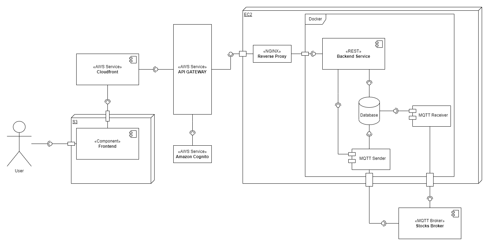

# 2023-2 / IIC2173 - E1 | Fintech Async | Explicación UML

El diagrama resultante es:

## Frontend

El usuario se comunica con la aplicación mediante un frontend hecho sobre el framework Koa, desplegado en un S3 de AWS con Cloudfront.
Aquí el usuario podrá revisar las empresas y el valor de sus acciones.
Como tambien, realizar solicitudes de compra y revisar el estado de sus solicitudes.

Las solicitudes de parte del usuario llegan a la API Gateway, otro servicio de AWS.

## API Gateway

La API Gateway de AWS otorga una protección a la aplicación.
Manejando los endpoints accesibles y el protocolo CORS. Utilizando Amazon Cognito, se encarga de manejar los usuarios: creación y autenticación.

## Backend

El backend de la aplicación es deployado en una instancia EC2. Donde todas las solicitudes primero pasan por el proxy inverso de NGINX.
Luego, son recibidas por la aplicación, quien se encarga de procesar la respuesta.
Finalmente, la respuesta seguirá el mismo flujo de la solicitud, pero en reversa.

## Aplicación

La aplicación consiste en cuatro contenedores dockerizados que se comunican entre ellos mediante un volumen compartido.
Estos contenedores son: **Backend Service**, **Database**, **MQTT Sender** y **MQTT Receiver**.

### Backend Service

Se encarga de procesar las solicitudes que llegan del Frontend. Se comunica con la **Database** para guardar, consultar y actualizar los datos. También se comunica con el **MQTT Sender** para delegarle la responsabilidad de generar la solicitud de compra en el Stocks Broker 
### Database

Consiste en la base de datos de la aplicación. Se comunica con los otros 3 contenedores. Tiene la función de almacenar la información de la aplicación.
### MQTT Sender

Mediante el protocolo MQTT, se suscribe al tópico `stocks/request` para enviar solicitudes de compra de los usuarios. Solo se activa cuando el **Backend Service** lo solicita, ejecutando una función que publica la solicitud 
### MQTT Receiver

Al igual que el anterior, este contenedor también utiliza el protocolo MQTT.
Con la diferencia, que este contenedor solo se dedica a escuchar los mensajes enviados por el MQTT Broker.
Se suscribe a los tópicos `stocks/info` y `stocks/validation`.

Del primer tópico recibe la información actualizada del valor de los stocks cada 5 minutos y se ejecuta una función que guarda y actualiza valores en la **Database**.
Del segundo tópico recibe las validaciones de las solicitudes de compra. Para esta entrega, se hace un filtro y solo se consideran las solicitudes hechas por nuestro grupo 3. Al recibirlas, se ejecuta una función que actualiza el estado de la solicitud a aceptado o rechazado, según sea el caso.